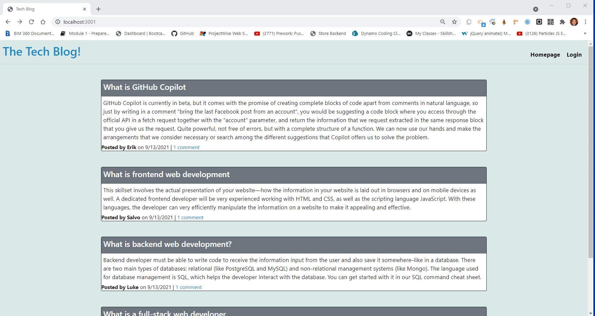

# Tech Blog

[](https://opensource.org/licenses/MIT)


[](https://www.npmjs.com/package/mysql2)
[](https://www.npmjs.com/package/sequelize)
[](https://www.npmjs.com/package/express)
[](https://www.npmjs.com/package/express-session)
[](https://www.npmjs.com/package/dotenv)
[](https://dashboard.heroku.com/)


<details>
<summary><h2>Table of Contents</h2></summary>

- [Description](#description)
- [Installation](#installation)
- [Usage](#usage)
- [License](#license)
- [Contributing](#contributing)
- [Follow](#follow)
</details>

----

## Description

For this project I had to build a CMS-style blog site similar to a Wordpress site, where developers can publish their blog posts and comment on other developers’ posts as well.The app follows the MVC paradigm in its architectural structure, using [Handlebars.js](https://handlebarsjs.com/) as the templating language, [Sequelize](https://www.npmjs.com/package/sequelize) as the ORM, and the [express-session](https://www.npmjs.com/package/express-session) npm package for authentication.

The following animation shows the web application's appearance and functionality:



You can view the deployed App at this link. [Tech Blog deployed](https://tech-blog-deployed.herokuapp.com/)

----

## Installation

💾    

- This application need node.js, please refer to [Offical website](https://nodejs.org/en/download/) for installation
- This application also need to install mysql, please refer to [mysql](https://coding-boot-camp.github.io/full-stack/mysql/mysql-installation-guide/) for installation
- Add your mysql password to the  ```.env``` file
- Install required node packages by running the following at the root of your project

    ```bash
    npm install
    ```

- Create database by running  ```SOURCE db/schema.sql``` at the root of your project from the MySQL shell
- Add sample data to the database by running  ```node seeds/seed``` at the root of your project

----

## Usage

💻   
  
Run the following command at the root of your project to start the application’s server
```bash
npm start
 ```

----

## License

This App is covered by the \


----

## Contributing

Fork this repository if you want to contribute\
[](https://github.com/MM-SalvoDragotta/mvc-tech-blog/fork)

----

## Follow
[](https://twitter.com/Dynamo_Sydney)\
[](https://github.com/MM-SalvoDragotta/)